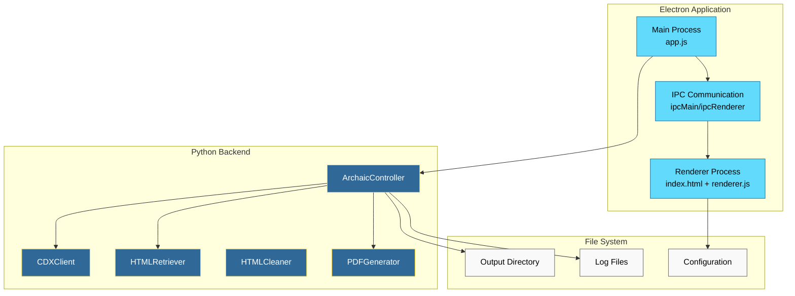
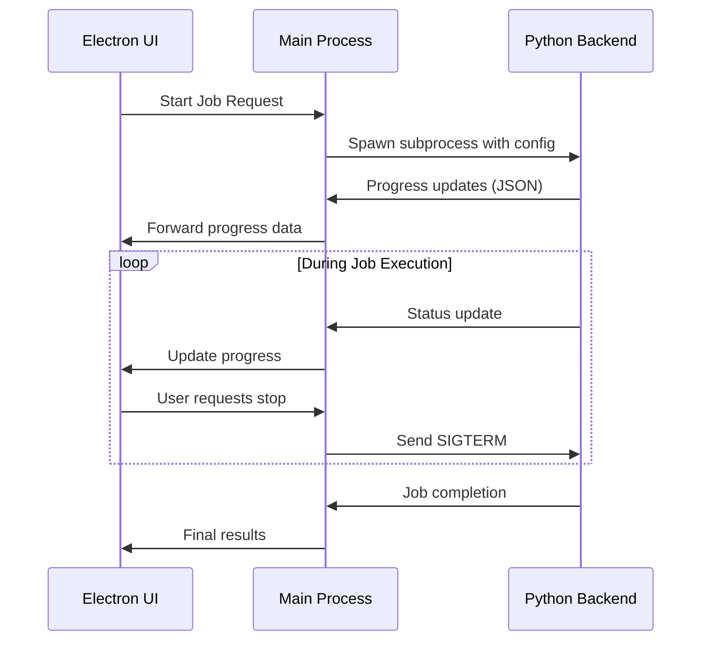

# Archaic Electron Frontend Specification

## Overview

This specification outlines the design for converting the existing Tkinter-based Archaic application into a modern Electron desktop application. The Electron frontend will provide a more polished, cross-platform user interface while maintaining integration with the existing Python backend through IPC (Inter-Process Communication).

## Technology Stack & Dependencies

### Frontend Stack
- **Electron**: Main application framework
- **Node.js**: Runtime environment
- **HTML5/CSS3**: UI markup and styling
- **Vanilla JavaScript**: Application logic (avoiding heavy frameworks for simplicity)
- **CSS Grid/Flexbox**: Layout system
- **Font Awesome**: Icon library

### Backend Integration
- **Python**: Existing backend services remain unchanged
- **Child Process**: Spawn Python scripts from Electron main process
- **JSON-RPC/Stdio**: Communication protocol between Electron and Python
- **File System Watchers**: Monitor output directories for real-time updates

### Development Tools
- **Electron Builder**: Application packaging and distribution
- **ESLint**: Code linting
- **Prettier**: Code formatting

## Architecture



## Component Architecture

### Main Process Components

#### ApplicationManager
- **Purpose**: Central application lifecycle management
- **Responsibilities**:
  - Window creation and management
  - Application menu setup
  - Global shortcuts and system tray integration
  - Auto-updater integration

#### PythonProcessManager
- **Purpose**: Manages Python backend subprocess
- **Responsibilities**:
  - Spawn and terminate Python processes
  - Monitor process health and restart if needed
  - Handle process communication via stdio
  - Error handling and logging

#### IPCHandler
- **Purpose**: Facilitates communication between main and renderer processes
- **Responsibilities**:
  - Route messages between frontend and backend
  - Serialize/deserialize data
  - Handle async operations
  - Maintain connection state

### Renderer Process Components

#### UIController
- **Purpose**: Main UI coordination and state management
- **Properties**:
  - `currentJob`: Current archiving job state
  - `settings`: Application configuration
  - `connectionStatus`: Backend connection status
- **Methods**:
  - `initializeUI()`: Setup UI components
  - `updateProgress(data)`: Update progress displays
  - `handleJobComplete(stats)`: Handle job completion

#### JobConfigPanel
- **Purpose**: User input and job configuration
- **Properties**:
  - `targetUrl`: URL pattern to archive
  - `outputDirectory`: Output path selection
  - `advancedOptions`: Concurrency, delay, etc.
- **Methods**:
  - `validateInput()`: Input validation
  - `getJobConfig()`: Serialize configuration
  - `resetForm()`: Clear form inputs

#### ProgressMonitor
- **Purpose**: Real-time progress tracking and display
- **Properties**:
  - `discovered`: Number of URLs discovered
  - `completed`: Number of pages completed
  - `failed`: Number of failed requests
  - `currentUrl`: Currently processing URL
- **Methods**:
  - `updateCounters(stats)`: Update numerical counters
  - `addUrlStatus(url, status)`: Add URL to status list
  - `updateCurrentActivity(message)`: Update activity indicator

#### LogViewer
- **Purpose**: Display application logs and job output
- **Properties**:
  - `logLevel`: Current log level filter
  - `maxLines`: Maximum lines to display
- **Methods**:
  - `appendLog(message, level)`: Add new log entry
  - `clearLogs()`: Clear log display
  - `exportLogs()`: Save logs to file

#### SettingsManager
- **Purpose**: Application configuration management
- **Properties**:
  - `userSettings`: User preferences
  - `defaultSettings`: Default configuration
- **Methods**:
  - `loadSettings()`: Load from storage
  - `saveSettings()`: Persist to storage
  - `resetToDefaults()`: Reset configuration

## UI Layout & Styling Strategy

### Layout Structure
```
┌─────────────────────────────────────────────────────────────┐
│ Title Bar (custom)                                   [-][□][×]│
├─────────────────────────────────────────────────────────────┤
│ Menu Bar: File | Edit | View | Tools | Help                │
├─────────────────────────────────────────────────────────────┤
│ ┌─────────────────────────────────────────────────────────┐ │
│ │ Job Configuration Panel                                 │ │
│ │ ┌─────────────────────────┐ ┌─────────────────────────┐ │ │
│ │ │ URL Input               │ │ Output Directory        │ │ │
│ │ └─────────────────────────┘ └─────────────────────────┘ │ │
│ │ ┌─────────────────────────┐ ┌─────────────────────────┐ │ │
│ │ │ Options Checkboxes      │ │ Advanced Settings       │ │ │
│ │ └─────────────────────────┘ └─────────────────────────┘ │ │
│ └─────────────────────────────────────────────────────────┘ │
├─────────────────────────────────────────────────────────────┤
│ ┌─────────────────────────────────────────────────────────┐ │
│ │ Progress & Status Panel                                 │ │
│ │ ┌─────────────────────────┐ ┌─────────────────────────┐ │ │
│ │ │ Progress Bar            │ │ Action Buttons          │ │ │
│ │ └─────────────────────────┘ └─────────────────────────┘ │ │
│ │ ┌───────────────────────────────────────────────────────┐│ │
│ │ │ Statistics Counters (Discovered/Completed/Failed)    ││ │
│ │ └───────────────────────────────────────────────────────┘│ │
│ └─────────────────────────────────────────────────────────┘ │
├─────────────────────────────────────────────────────────────┤
│ ┌─────────────────────────────────────────────────────────┐ │
│ │ URL Status Table                                        │ │
│ │ │ Status        │ URL                                 │ │ │
│ │ │ ✓ Completed   │ example.com/article/1              │ │ │
│ │ │ ⚠ Failed      │ example.com/article/2              │ │ │
│ │ │ ⟳ Processing  │ example.com/article/3              │ │ │
│ └─────────────────────────────────────────────────────────┘ │
├─────────────────────────────────────────────────────────────┤
│ ┌─────────────────────────────────────────────────────────┐ │
│ │ Log Output (Collapsible)                                │ │
│ │ [2024-01-15 10:30:12] Discovered 15 URLs               │ │
│ │ [2024-01-15 10:30:13] Processing article/1             │ │
│ │ [2024-01-15 10:30:15] Generated PDF for article/1      │ │
│ └─────────────────────────────────────────────────────────┘ │
└─────────────────────────────────────────────────────────────┘
```

### CSS Framework Approach
- **Modern CSS**: CSS Grid and Flexbox for layout
- **CSS Custom Properties**: Theme customization and dark mode support
- **Component-based Styles**: Modular CSS architecture
- **Responsive Design**: Adaptive layouts for different window sizes

### Visual Design System
```css
:root {
  /* Primary Colors */
  --primary-blue: #2563eb;
  --primary-blue-dark: #1d4ed8;
  --primary-blue-light: #3b82f6;
  
  /* Semantic Colors */
  --success-green: #10b981;
  --warning-yellow: #f59e0b;
  --error-red: #ef4444;
  --info-blue: #06b6d4;
  
  /* Neutral Colors */
  --gray-50: #f9fafb;
  --gray-100: #f3f4f6;
  --gray-900: #111827;
  
  /* Typography */
  --font-family-sans: 'Inter', system-ui, sans-serif;
  --font-size-sm: 0.875rem;
  --font-size-base: 1rem;
  --font-size-lg: 1.125rem;
  
  /* Spacing */
  --spacing-xs: 0.25rem;
  --spacing-sm: 0.5rem;
  --spacing-md: 1rem;
  --spacing-lg: 1.5rem;
  --spacing-xl: 2rem;
  
  /* Border Radius */
  --border-radius-sm: 0.25rem;
  --border-radius-md: 0.5rem;
  --border-radius-lg: 0.75rem;
}
```

## State Management

### Application State Structure
```javascript
const AppState = {
  // Connection state
  connection: {
    status: 'disconnected', // disconnected, connecting, connected, error
    pythonProcess: null,
    lastHeartbeat: null
  },
  
  // Current job state
  currentJob: {
    id: null,
    status: 'idle', // idle, running, paused, completed, error
    config: {
      targetUrl: '',
      outputDirectory: '',
      delay: 1.5,
      concurrency: 1,
      offlineAssets: true,
      singleFileHtml: false
    },
    progress: {
      discovered: 0,
      completed: 0,
      failed: 0,
      currentUrl: '',
      percentage: 0
    }
  },
  
  // URL status tracking
  urlStatuses: [
    {
      url: 'example.com/article/1',
      status: 'completed', // pending, processing, completed, failed
      timestamp: '2024-01-15T10:30:15Z',
      error: null
    }
  ],
  
  // Application logs
  logs: [
    {
      timestamp: '2024-01-15T10:30:12Z',
      level: 'info', // debug, info, warn, error
      message: 'Discovered 15 URLs',
      source: 'cdx_client'
    }
  ],
  
  // User settings
  settings: {
    theme: 'light', // light, dark, auto
    autoStartOnLaunch: false,
    showAdvancedOptions: true,
    maxLogLines: 1000,
    notifications: true
  }
};
```

### State Management Pattern
- **Event-driven updates**: Use custom events for state changes
- **Immutable updates**: Always create new state objects
- **Local storage persistence**: Save settings and recent configurations
- **State validation**: Validate state transitions and data integrity

## Backend Integration Architecture

### Communication Protocol


### IPC Message Types
```typescript
interface IPCMessage {
  id: string;
  type: 'job-start' | 'job-stop' | 'job-status' | 'progress-update' | 'log-message';
  payload: any;
  timestamp: string;
}

interface JobStartMessage extends IPCMessage {
  type: 'job-start';
  payload: {
    targetUrl: string;
    outputDirectory: string;
    options: JobOptions;
  };
}

interface ProgressUpdateMessage extends IPCMessage {
  type: 'progress-update';
  payload: {
    type: 'discovery' | 'url' | 'counters';
    data: ProgressData;
  };
}

interface LogMessage extends IPCMessage {
  type: 'log-message';
  payload: {
    level: 'debug' | 'info' | 'warn' | 'error';
    message: string;
    source: string;
  };
}
```

### Python Integration Strategy
```javascript
class PythonProcessManager {
  constructor() {
    this.pythonProcess = null;
    this.messageQueue = [];
    this.isConnected = false;
  }
  
  async startPythonBackend() {
    const pythonPath = await this.findPythonExecutable();
    const scriptPath = path.join(__dirname, '../src/core/controller.py');
    
    this.pythonProcess = spawn(pythonPath, [scriptPath, '--electron-mode'], {
      stdio: ['pipe', 'pipe', 'pipe'],
      cwd: path.dirname(scriptPath)
    });
    
    this.setupProcessListeners();
  }
  
  setupProcessListeners() {
    this.pythonProcess.stdout.on('data', (data) => {
      try {
        const messages = data.toString().trim().split('\n');
        messages.forEach(line => {
          if (line.trim()) {
            const message = JSON.parse(line);
            this.handlePythonMessage(message);
          }
        });
      } catch (error) {
        console.error('Failed to parse Python message:', error);
      }
    });
    
    this.pythonProcess.stderr.on('data', (data) => {
      console.error('Python stderr:', data.toString());
    });
    
    this.pythonProcess.on('close', (code) => {
      console.log(`Python process exited with code ${code}`);
      this.isConnected = false;
    });
  }
  
  sendMessage(message) {
    if (this.pythonProcess && this.isConnected) {
      this.pythonProcess.stdin.write(JSON.stringify(message) + '\n');
    } else {
      this.messageQueue.push(message);
    }
  }
}
```

## File Structure

```
electron-frontend/
├── package.json
├── package-lock.json
├── electron-builder.yml
├── main/
│   ├── app.js                    # Main process entry point
│   ├── window-manager.js         # Window creation and management
│   ├── python-process-manager.js # Python subprocess management
│   ├── ipc-handler.js           # IPC communication handling
│   ├── menu.js                  # Application menu definition
│   └── auto-updater.js          # Auto-update functionality
├── renderer/
│   ├── index.html               # Main application window
│   ├── styles/
│   │   ├── main.css             # Main stylesheet
│   │   ├── components.css       # Component-specific styles
│   │   ├── themes.css           # Theme definitions
│   │   └── variables.css        # CSS custom properties
│   ├── scripts/
│   │   ├── renderer.js          # Main renderer script
│   │   ├── ui-controller.js     # UI coordination
│   │   ├── job-config-panel.js  # Job configuration component
│   │   ├── progress-monitor.js  # Progress tracking component
│   │   ├── log-viewer.js        # Log display component
│   │   ├── settings-manager.js  # Settings management
│   │   └── utils.js             # Utility functions
│   └── assets/
│       ├── icons/               # Application icons
│       ├── images/              # UI images
│       └── fonts/               # Custom fonts
├── build/
│   ├── icon.ico                 # Windows icon
│   ├── icon.png                 # Linux icon
│   └── icon.icns                # macOS icon
└── docs/
    ├── user-guide.md            # User documentation
    └── development.md           # Development setup guide
```

## Testing Strategy

### Unit Testing Framework
- **Jest**: JavaScript testing framework
- **Electron Testing**: Use `@electron/testing` for Electron-specific tests
- **Mock Python Backend**: Create mock Python processes for testing

### Test Categories

#### Main Process Tests
```javascript
describe('PythonProcessManager', () => {
  test('should start Python subprocess correctly', async () => {
    const manager = new PythonProcessManager();
    await manager.startPythonBackend();
    expect(manager.isConnected).toBe(true);
  });
  
  test('should handle Python process crashes gracefully', async () => {
    const manager = new PythonProcessManager();
    // Simulate process crash
    manager.pythonProcess.kill('SIGKILL');
    expect(manager.isConnected).toBe(false);
  });
});
```

#### Renderer Process Tests
```javascript
describe('JobConfigPanel', () => {
  test('should validate URL input correctly', () => {
    const panel = new JobConfigPanel();
    expect(panel.validateInput('https://example.com')).toBe(true);
    expect(panel.validateInput('invalid-url')).toBe(false);
  });
  
  test('should serialize job configuration', () => {
    const panel = new JobConfigPanel();
    panel.targetUrl = 'https://example.com';
    panel.outputDirectory = '/tmp/output';
    
    const config = panel.getJobConfig();
    expect(config.targetUrl).toBe('https://example.com');
    expect(config.outputDirectory).toBe('/tmp/output');
  });
});
```

#### Integration Tests
```javascript
describe('Backend Integration', () => {
  test('should complete full archiving workflow', async () => {
    const app = new ArchaicElectronApp();
    const jobConfig = {
      targetUrl: 'https://example.com/test',
      outputDirectory: '/tmp/test-output'
    };
    
    const result = await app.startArchivingJob(jobConfig);
    expect(result.status).toBe('completed');
    expect(result.stats.completed).toBeGreaterThan(0);
  });
});
```

### End-to-End Testing
- **Playwright**: Cross-platform E2E testing
- **Test scenarios**: Complete user workflows
- **Performance testing**: Memory usage and responsiveness
- **Platform testing**: Windows, macOS, and Linux compatibility

## Advanced Features Implementation

### System Tray Integration
```javascript
class SystemTrayManager {
  constructor() {
    this.tray = null;
  }
  
  createTray() {
    this.tray = new Tray(path.join(__dirname, 'assets/tray-icon.png'));
    
    const contextMenu = Menu.buildFromTemplate([
      { label: 'Show Archaic', click: () => this.showMainWindow() },
      { label: 'Start Quick Archive', click: () => this.showQuickArchiveDialog() },
      { type: 'separator' },
      { label: 'Quit', click: () => app.quit() }
    ]);
    
    this.tray.setContextMenu(contextMenu);
    this.tray.setToolTip('Archaic - Archival Web Scraper');
  }
}
```

### Notification System
```javascript
class NotificationManager {
  static showJobComplete(stats) {
    new Notification('Archiving Complete', {
      body: `Successfully archived ${stats.completed} pages`,
      icon: path.join(__dirname, 'assets/success-icon.png')
    });
  }
  
  static showJobError(error) {
    new Notification('Archiving Error', {
      body: `Error: ${error.message}`,
      icon: path.join(__dirname, 'assets/error-icon.png')
    });
  }
}
```

### Auto-Update Implementation
```javascript
class AutoUpdater {
  constructor() {
    autoUpdater.setFeedURL({
      provider: 'github',
      owner: 'your-username',
      repo: 'archaic'
    });
  }
  
  checkForUpdates() {
    autoUpdater.checkForUpdatesAndNotify();
  }
  
  setupEventHandlers() {
    autoUpdater.on('update-available', () => {
      dialog.showMessageBox({
        type: 'info',
        title: 'Update Available',
        message: 'A new version is available. It will be downloaded in the background.',
        buttons: ['OK']
      });
    });
    
    autoUpdater.on('update-downloaded', () => {
      dialog.showMessageBox({
        type: 'info',
        title: 'Update Ready',
        message: 'Update downloaded. Application will restart to apply the update.',
        buttons: ['Restart Now', 'Later']
      }).then((result) => {
        if (result.response === 0) {
          autoUpdater.quitAndInstall();
        }
      });
    });
  }
}
```

### Performance Monitoring
```javascript
class PerformanceMonitor {
  constructor() {
    this.metrics = {
      memoryUsage: [],
      cpuUsage: [],
      jobDuration: []
    };
  }
  
  startMonitoring() {
    setInterval(() => {
      const usage = process.memoryUsage();
      this.metrics.memoryUsage.push({
        timestamp: Date.now(),
        heapUsed: usage.heapUsed,
        heapTotal: usage.heapTotal
      });
      
      // Keep only last 100 measurements
      if (this.metrics.memoryUsage.length > 100) {
        this.metrics.memoryUsage.shift();
      }
    }, 5000);
  }
  
  getAverageMemoryUsage() {
    const recent = this.metrics.memoryUsage.slice(-10);
    return recent.reduce((sum, m) => sum + m.heapUsed, 0) / recent.length;
  }
}
```